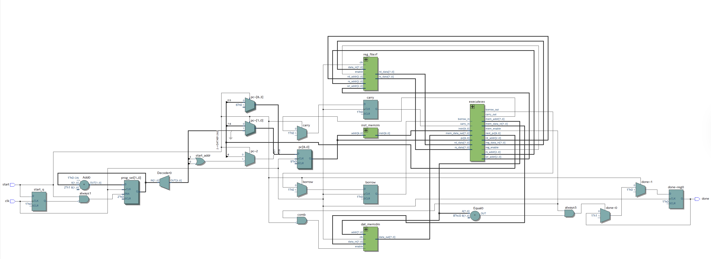

# Custom 9-bit ISA CPU

A fully custom CPU designed from scratch in SystemVerilog — ISA, assembler, datapath, and all three benchmark programs.

The interesting part is the constraint: every instruction is exactly **9 bits wide**, the entire instruction memory is **512 entries** (2⁹ slots), there are only **8 registers** each holding **8 bits**, and the data path is 8 bits throughout. That's not a lot to work with.

Despite those limits, the CPU runs three non-trivial programs:

- Iterates over all **496 unique pairs** of 32 signed 16-bit numbers and finds the minimum and maximum **Hamming distance** (bit-difference count) between any two
- Does the same loop to find the minimum and maximum **absolute arithmetic difference**, tracking a 16-bit result across two 8-bit registers
- Computes **16 full 32-bit products** from signed 16-bit × 16-bit multiplication, built entirely out of 8-bit multiplies and a custom `SIGN` instruction for sign correction

Fitting 16-bit arithmetic and multi-word accumulation into an 8-bit register file with only 9 bits of instruction encoding — and keeping it all under 512 instructions — is the core design challenge. All three programs pass **10/10** test cases.

---

## RTL Schematic



---

## Architecture Overview

| Parameter | Value |
|---|---|
| Instruction width | 9 bits (fixed-length) |
| Data path | 8-bit |
| Registers | 8 general-purpose (R0–R7), 8 bits each |
| Instruction memory | 512 × 9-bit (ROM, loaded from `program.txt`) |
| Data memory | 256 × 8-bit (RAM) |
| Flags | Carry, Borrow |
| Opcodes | 14 |

### Module Hierarchy

```
DUT  (top-level)
├── inst_mem   — 512-entry instruction ROM
├── reg_file   — 8 × 8-bit register file (dual-read / single-write)
├── dat_mem    — 256 × 8-bit data RAM
└── execute    — combinational instruction decoder / ALU
```

The top-level `DUT` exposes three ports: `clk`, `start`, and `done`. Asserting `start` resets the PC to the current program's start address and clears flags. `done` is set when the program writes to the sentinel address `mem[192]`.

Three programs share a single instruction memory with non-overlapping address ranges:

| Program | Start Address |
|---|---|
| Program 1 | 0 |
| Program 2 | 64 |
| Program 3 | 192 |

---

## Instruction Set Architecture

### Type 1 — Register ops `[4-bit opcode | 3-bit Rd | 2-bit Rs]`

| Mnemonic | Opcode | Operation |
|---|---|---|
| ADD | 0000 | Rd = Rd + Rs + carry; sets carry |
| ADDX | 0001 | Rd = Rd + Rs[+4] + carry; sets carry |
| SUB | 0010 | Rd = Rd − Rs[+4] − borrow; sets borrow |
| SUBX | 0011 | Rd = Rd − Rs − borrow; sets borrow |
| MUL | 0100 | Rd = (Rd × Rs)\[7:0\] |
| MULC | 0101 | Rd = (Rd × Rs)\[15:8\] |
| STR | 0110 | mem\[Rs\] = Rd |
| LD | 0111 | Rd = mem\[Rs\] |
| XOR | 1000 | Rd = Rd ^ Rs |

### Type 2 — Immediate ops `[4-bit opcode | 3-bit Rd | 2-bit imm]`

| Mnemonic | Opcode | Operation |
|---|---|---|
| SHIFT | 1001 | imm\[1\]=0: Rd <<(imm\[0\]+1); imm\[1\]=1: Rd >>(imm\[0\]+1) |
| LDI | 1010 | Rd = imm (0–3) |
| ADDI | 1011 | Rd = Rd + imm; sets carry |
| SUBI | 1100 | Rd = Rd − imm; sets borrow |

### Type 3 — Branch ops `[4-bit opcode | 5-bit signed offset]`

| Mnemonic | Opcode | Operation |
|---|---|---|
| BBS | 1101 | if borrow: PC = PC + offset×2; clears borrow |
| J | 1110 | PC = PC + offset×2 (unconditional) |

### Type 4 — Special ops `[1111 | 3-bit Rd | 2-bit fun]`

| Mnemonic | fun | Operation |
|---|---|---|
| NOT | 00 | Rd = ~Rd |
| COU | 01 | Rd = popcount(Rd) |
| SIGN | 10 | borrow = Rd\[7\] (sign bit) |
| DONE | 11 | signals program completion |

---

## Programs

### Program 1 — Min/Max Hamming Distance

Computes the minimum and maximum Hamming distance (bit-difference count) across all pairs of 32 signed 16-bit values stored as byte pairs in `mem[0:63]`.

| Output | Location |
|---|---|
| Minimum Hamming distance | `mem[64]` |
| Maximum Hamming distance | `mem[65]` |

**Status: PASS 10/10**

### Program 2 — Min/Max Arithmetic Distance

Computes the minimum and maximum absolute arithmetic difference across all pairs of the same 32 signed 16-bit values. Results are stored as unsigned 16-bit big-endian values.

| Output | Location |
|---|---|
| Minimum \|diff\| | `mem[66:67]` |
| Maximum \|diff\| | `mem[68:69]` |

**Status: PASS 10/10**

### Program 3 — 16-bit × 16-bit Signed Multiplication

Computes 16 signed 32-bit products from 16 pairs of signed 16-bit values in `mem[0:63]`. Uses the custom `SIGN` instruction for sign-correction of partial products.

| Output | Location |
|---|---|
| Product k (32-bit, big-endian) | `mem[64+4k .. 67+4k]`, k = 0..15 |

**Status: PASS 10/10**

---

## Repository Structure

```
.
├── rtl/                   # SystemVerilog source
│   ├── DUT.sv             # Top-level
│   ├── execute.sv         # ALU / instruction decoder
│   ├── inst_mem.sv        # Instruction ROM
│   ├── reg_file.sv        # Register file
│   └── dat_mem.sv         # Data RAM
├── assembly_files/        # Assembly source and assembled machine code
│   ├── p1.asm / p1_machine.txt
│   ├── p2.asm / p2_machine.txt
│   ├── p3.asm / p3_machine.txt
│   └── assembler.py       # Assembler (ASM → binary)
├── test benches/          # Simulation testbenches and test inputs
│   └── test_files/        # test0.txt – test9.txt
├── Quartus/               # Quartus project (RTL viewer)
│   ├── isa_cpu.qpf
│   ├── isa_cpu.qsf
│   └── program.txt
├── writeups/              # Course documentation
├── RTL_View.png           # RTL schematic screenshot
├── run.sh                 # Single-program simulation runner
├── test_all.sh            # Full regression (all 3 programs × 10 tests)
└── check.py               # Output verification script
```

---

## How to Run

**Simulate a single program:**
```bash
bash run.sh assembly_files/p1.asm "test benches/test_files/test0.txt"
bash run.sh assembly_files/p2.asm "test benches/test_files/test0.txt"
bash run.sh assembly_files/p3.asm "test benches/test_files/test0.txt"
```

**Run full regression (all programs × all 10 tests):**
```bash
bash test_all.sh
```

**Open in Quartus (RTL Viewer):**
1. Open `Quartus/isa_cpu.qpf` in Quartus Prime
2. Run Processing → Start Analysis & Synthesis
3. Open Tools → Netlist Viewers → RTL Viewer

---

*Student: Ciro Zhang — CSE 141L*
